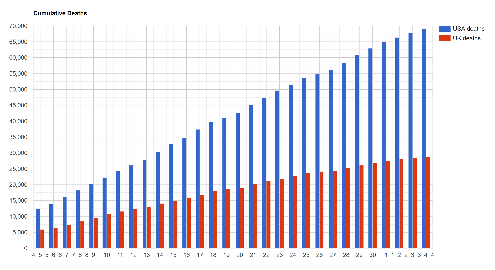

 # Cumulative deaths column chart
 ## Backend PHP
 - Pulls data from API
 - Formats it into arrays
 - Encodes to JSON and returns to JavaScript
 
 ## JavaScript
 - Makes a synchronous request to the PHP page
 - Converts the JSON resonse into a Google DataTable
 - Sets the options for the chart
 - Draws the chart
 
 
 
 
