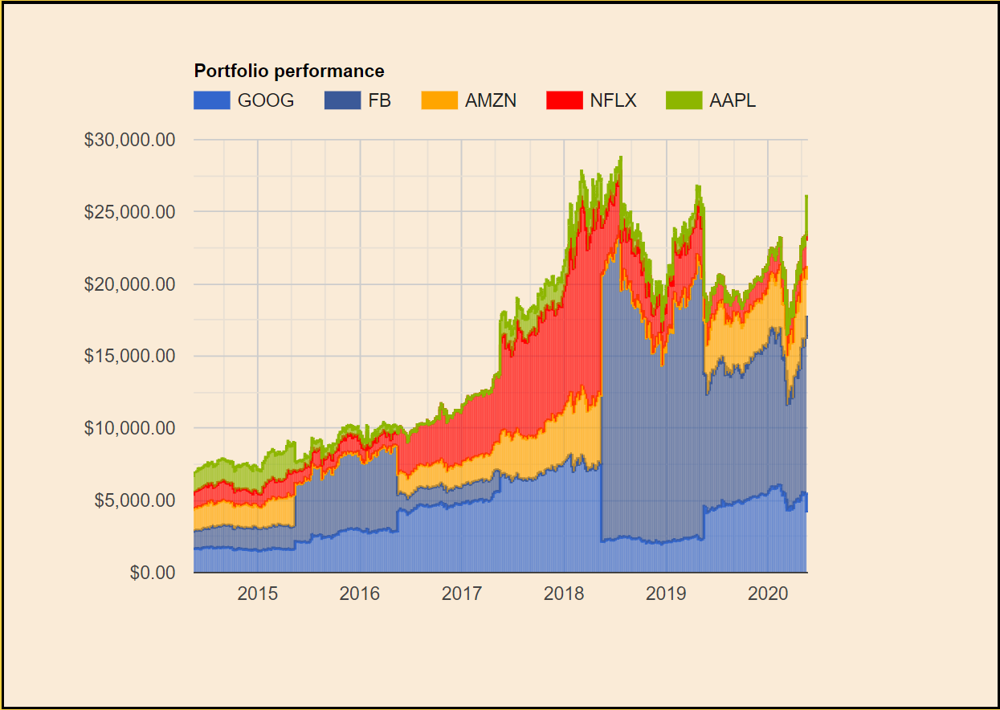
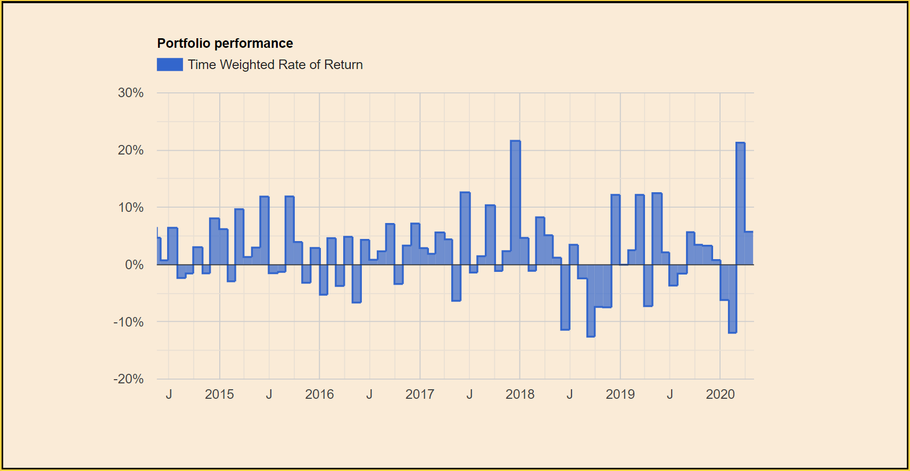

# Finance graphs
In this section, I made a multipurpose JavaScript file to draw **Stepped Area Charts**.

My application was to use it for graphing investments, but it is suitable for other applications.

I found Stepped Area charts to be quite versatile in that it can look like a line chart or a bar chart, depending on how many data points you give it. 

I am not including the PHP file which generates the data to be graphed, because this will be different in every use case, but the format should be something like this:

    echo json_encode(array("22 March 1991"=>array("Bank balance"=>50)))

Here are two examples of graphs drawn by this function, when given different data:

Multiple series:

 
 
 Single series (with negatives):
 
 
